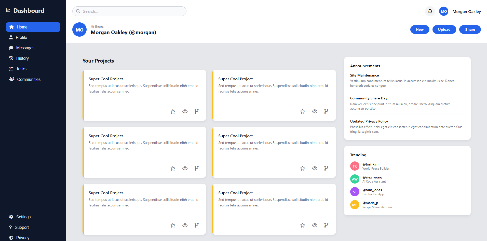

# Admin Dashboard

# 📄 Descrição
Interface de dashboard administrativo moderna, construída com HTML e CSS puro utilizando CSS Grid e metodologia BEM para organização de código.
​
# 💻 Sobre o projeto
Admin Dashboard é um projeto desenvolvido para o The Odin Project com foco em domínio de CSS Grid Layout e boas práticas de estruturação de interfaces complexas.

O desafio consistiu em criar um dashboard completo sem uso de frameworks, aplicando CSS Grid para layout de duas dimensões, nomenclatura BEM para classes CSS, e design system consistente com cores, espaçamentos e componentes reutilizáveis.

# 🎨 Layout
Estrutura principal
Sidebar (fixa) - Navegação principal + secundária

Header - Busca + perfil + ações rápidas

Main content - Grid 2 colunas:

Esquerda: Grid de projetos (2x3)

Direita: Anúncios + Trending

Paleta de cores
Primary: #2563eb (azul)

Background: #e5e7eb (cinza claro)

Card: #ffffff (branco)

Sidebar: #0f172a (azul escuro)

Accent: #fbbf24 (amarelo)



# 🚀 Como executar o projeto
1. Clonar o repositório
```bash
https://github.com/henrymzs/admin-dashboard.git
cd admin-dashboard
```

2. Abrir no navegador
Live Server (VSCode)
- Clique com botão direito → "Open with Live Server"

# 🛠 Tecnologias
As seguintes ferramentas foram usadas na construção do projeto:
Front-End
- HTML5
    - Estrutura semântica
    - ARIA labels para acessibilidade

- CSS3
    - CSS Grid - Layout principal em duas dimensões
    - Flexbox - Alinhamento de componentes
    - Transições e hover effects
    - Custom properties (variáveis CSS implícitas)

- Font Awesome
    - Ícones de navegação e ações

Metodologia CSS
- BEM (Block Element Modifier) - Nomenclatura de classes estruturada
```bash
.sidebar__item--active
.header__search-input
.project-card__actions
```

# 💪 Como contribuir para o projeto
1. Faça um fork do projeto

2. Crie uma branch para sua feature:
```bash
git checkout -b feature/minha-feature
```

3. Commit suas mudanças:
```bash
git commit -m "feat: Adiciona responsividade mobile"
```

4. Push para a branch:
```bash
git push origin feature/minha-feature
```

5. Abra um Pull Request

# 🦸 Autor

[](https://github.com/henrymzs)
[](https://linkedin.com/in/henry-kaua)
[](mailto:henrykaua21@gmail.com)